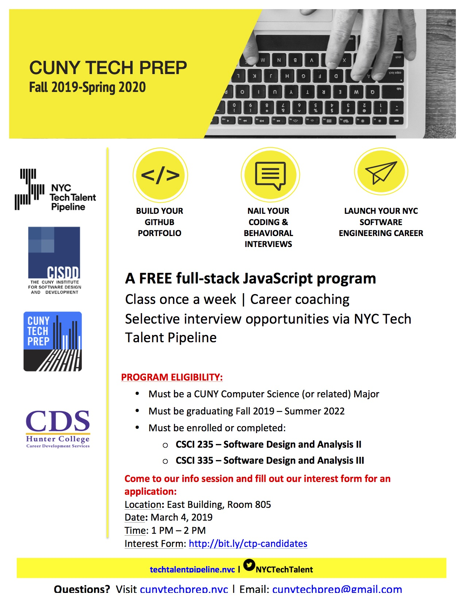

# Software Design and Analysis II 
## (CSCI 235) Spring 2019  
## Hunter College of The City University of New York

The primary focus of this course is the **design and analysis of algorithms and abstract data types**. To this end it introduces elementary data structures with related algorithms and their use in problem solving. The course also covers core computer science concepts such as abstraction, algorithm complexity, performance analysis and the tradeoffs between running time, storage size, clarity and extensibility that are at the core of software design. As a sequel to CSCI 135 it will also enhance your skills in C++ and Object Oriented Programming by introducing new tools such as Templates, Inheritance, Polymorphism, extend your understanding of pointers and dynamic memory allocation.

## Instructor: Tiziana Ligorio
**email:** tligorio@hunter.cuny.edu    
**Office:** Hunter North 1000-C (CoSSMO Lab)   
**Tel:** (212) 772-5213 (CS Department)

**Office Hours:** Friday 12-2pm Room 1001-A Hunter North **(note this is NOT my office)** or by appointment.  
**Note:** Office hours will be subject to change and cancellation, please check the annoucements on this page before visiting.
  
  
### UTA tutoring: 
**Lab 1001B -- Drop-in Tutoring**   
Mo - 11:00 - 3:00  
Tu - 11:00 - 5:00  
We - all tutoring in lab C  
Th - 1:00 - 6:00  
Fr - 11:00 - 5:00

**Lab 1001C -- Tutoring available to everyone during 136 labs, be mindful not to disrupt the ongoing lab session!**       
Mo - 1:00 - 7:15    
Tu - 2:00 - 4:00 .   
We - 9:00 - 7:15 .   
Th - 1:00 - 3:00, 7:00 - 9:00    
Fr - all tutoring in lab B

## Resources:

### [Syllabus](documents/CSCI235_Spring2019_Syllabus.pdf)   **-- PLEASE READ THIS CAREFULLY --**

### [Programming Rules](documents/CSCI235_Spring2019_ProgrammingRules.pdf) **-- PLEASE READ THIS CAREFULLY --**

### [Tentative Schedule -- Subject to change](Spring2019_schedule.md)  

### [Project Submission Help](gradescope_help.md)

### [Installing Windows Subsystem for Linux by -your classmate- Owen Kunhardt](documents/Installing_WSL.pdf)

### [A tutorial by Prof. Stewart Weiss on Separate Compilation](http://www.compsci.hunter.cuny.edu/~sweiss/resources/separateCompilation.pdf)

### [A tutorial by Prof. Stewart Weiss on File I/O in C++](http://www.compsci.hunter.cuny.edu/~sweiss/resources/fileIO.pdf)

## Announcements:

**2/7/2019 Changes to Project1B subission**   
I noticed that many of you have been trying to submit individual classes as you incrementally implement Project1B. To support that, I have decided to **split the submission of Project1B into 3, one submission per class**. I also now want you to **submit both the Interface and the Implementation files for each class**.
I have updated the project specification to reflect that, and I am about to open the 3-part submission on Gradescope.
For those of you who have already successfully completed the project **WONDERFUL JOB!!!!** I must however ask that you re-submit your files split across the 3 submissions, and please include the .hpp files this time.
By the end of the day I will delete the old single-submission on Gradescope.

**2/5/2019** Project 1B is posted on the course schedule. We will finish today's lecture on Friday and talk about inheritance then. 

**Welcome to CSCI 235, I hope we will have a fun and productive semester together!!!** 
