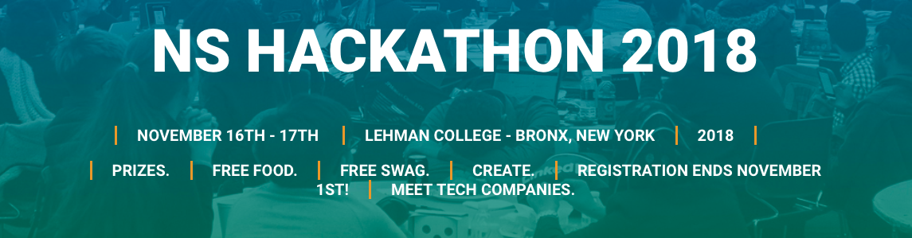
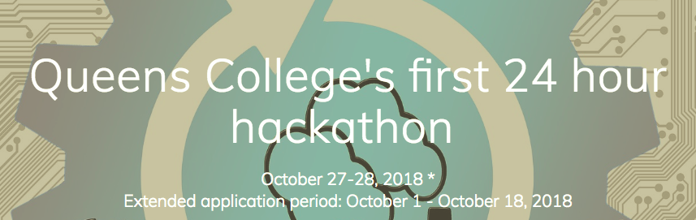

**email:** tligorio@hunter.cuny.edu  

**Office:** Hunter North 1000-C 

**Tel:** (212) 772-5213 (CS Department)

**Office Hours:** 

> Mondays 2:30 - 3:30

> Wednesday 2:30 - 3:30 

> **Room 1001-A** Hunter North **(note this is NOT my office)**

> or by appointment (I am usually available by appointment before clas at Silberman)

**UTA tutoring:**  
> Tuesday 2:00 - 4:00 Room C-06 (Silberman)

> Wednesday 1:00 - 5:30 Room 1001-B Hunter North (68th Street)

> Thursday 2:00 - 4:00 Room C-06 (Silberman)

# CSCI 235 - Software Analysis and Design II 
# Fall 2018

The primary focus of this course is the **design and analysis of algorithms and abstract data types**. To this end it introduces elementary data structures with related algorithms and their use in problem solving. The course also covers core computer science concepts such as abstraction, algorithm complexity, performance analysis and the tradeoffs between running time, storage size, clarity and extensibility that are at the core of software design. As a sequel to CSCI 135 it will also enhance your programming skills in C++ by introducing new tools such as Templates, Inheritance, Polymorphism, extend your understanding of pointers and dynamic memory allocation.

# [TENTATIVE SCHEDULE](schedule.md)

## [Syllabus](CSCI235_Fall2018_Syllabus.pdf)   **-- PLEASE READ THIS CAREFULLY --**

## [Programming Rules](CSCI235_Fall2018_ProgrammingRules.pdf) **-- PLEASE READ THIS CAREFULLY --**

# Announcements:

**12/4/2018** Project 5 submission is open on Gradescope, it will close (DUE) on **December 11 at 2pm**

**12/1/2018**  Project 6 is out, it is OPTIONAL, there will be NO SUBMISSION for this project

**11/28/2018**  NO OFFICE HOURS TODAY  
If you planned to come talk to me today during office hours please email me to make an appointment. Thank you!

## Final Exam Date: 12/18/2018   
##             1:45-3:45

**11/14/2018**  NO OFFICE HOURS TODAY  
If you planned to come talk to me today during office hours please email me to make an appointment. Thank you!

**11/13/2018**  
**CLASS CANCELLED TODAY   
We will resume regularly on Thursday.

**11/07/2018 Poject5 IS OUT** you can find it on the tentative schedule. By the way, the midterm solutions have also been up for a while on BlackBoard. 

**10/23/2018 -- Open Data For All New Yorkers** Come join an informal discussion of the NYC OpenData Project:
Event: Al Webber (NYC Director of Open Data) + Adrienne Schmoeker (NYC Director of Civic Engagement & Strategy) are visiting Hunter to talk about their work with NYC Open Data.  
*Date: Wednesday October 24
Time: 11:10am - 12:25pm
Location: Hunter East, 12th Floor, Room 1203*

[Let us know if you're attending](https://opendatatalkwithadrienneschmoe.splashthat.com)

**10/23/2018 -- Hunter College Career Fair**  *Wednesday, October 24, 11:30-2:00, 3rd floor cafeteria.* Over 65 companies will be present with part time/full time jobs and internship positions. Even if students are not currently looking for a position it is a good idea to attend and meet the friendly recruiters and learn more about the companies for future career planning.
 
[Visit their website for more info](http://www.hunter.cuny.edu/studentservices/cds)

**10/16/2018 -- PROJECT 4 IS OUT** I will go over it in class on 10/23, please read it and come ready to ask questions!

**10/16/2018** Everyone who is still **confused about the copy constructor**, **look at slide 51 in the lecture notes Lecture8/9** 

**10/15/2018 Project 3 deadline postponed** to Wednesday 10/17 at midnight. You will receive email when gradescope is ready.

**10/15/2018 NO OFFICE HOURS TODAY** I will be available tomorrow before class by appointment. Thank you!

**10/11/2018** I will send email when Project 3 submission will open on gradescope. Please be ready to submit by the deadline on Tuesday.

**10/10/2018 NO OFFICE HOURS TODAY** I will be available Thursday before class by appointment, if anyone planned to see me today please send me email. Thank you!

**10/10/2018 Project3 Q&A:** If you have not completed Project 3 yet, tomorrow Thursday 10/11 is your chance to have all your questions answered. We will go over Project 3 at the beginning of lecture and make sure you have all the info you need for a successful submission! Don't miss it!!!!

**10/10/2018 Google info session LAST CHANCE TODAY!!!** Don't miss it! Check out their webpage for more info](https://googleinfosession.splashthat.com/)

**10/10/2018 Hackathon: 16-17 November** 

From the Lehman College National Society of Black Engineers (NSBE):

Lehman College's 5th annual student-run hackathon: Lehman Hacks, our event is taking place November 16th - 17th.

This is a great opportunity for students to collaborate and learn through active participation and problem-solving. The Hackathon is open to all majors and do not expect attendees to come in with any prior knowledge about coding, in fact, we will be hosting several workshops to teach fundamental practices so that every attendee can feel like they've contributed. The experience gained from this event has helped many of our students add to their portfolios and build on their skills. We have had several of our Sponsors hire students directly from our event, and they are interested in sourcing more of the talent at CUNY.

For more information:  [https://nshacks.com ](https://nshacks.com)

**10/10/2018 Hunter College CS Student Event Calendar:** [http://bit.ly/HunterTechCalendar](http://bit.ly/HunterTechCalendar)

**10/08/2018 -- Added sample output to Project3 description**

**10/01/2018 -- [Queens College Hackathon](http://www.hackattack2018.com/)**

**9/28/2018 -- Slight modifications to Project3** Slight modification in the wording pertaining to the copy constructor to avoid confusion. Also some changes to main()

**9/25/2018 -- No TA tutoring in lab Wednesday 9/26 and Thursday 9/27** 

**9/25/2018 -- Google Information Session** 

[Check out their webpage for more info](https://googleinfosession.splashthat.com)

[RSVP here](https://docs.google.com/forms/d/e/1FAIpQLSerMq19yz2K9iyE8-GKCnsyG31vM9_zZ3OwV_UiDCTz5KipyA/viewform)

**9/19/2018 -- 30-MIN DISCUSSION SESSION ABOUT PROJECT 2 AFTER CLASS TOMORROW** I will stay 30 minutes after class to answer questions about Project 2. We will have a group discussion and I will answer any questions about Project 2, however this will not be a debugging session.

**9/17/2018 -- NO CLASSES AND NO TUTORING TUESDAY 9/18 AND WEDNESDAY 9/19** The Skirball Science Learning Center will also be closed. If you need tutoring help you may resume tutoring on 9/20, [here is their schedule](Computer Science Tutoring Schedule.pdf)

**9/13/2018** After lecture today some of you were still in doubt about the **correctness of remove()** for the last item in the array. Here is a bit of rationale as to why it works: Assume the last item is the kth item at position k-1. item_coutnt_ is k, so item_count_- - is now k-1. items_[located_index] = items_[item_count_] is items_[k-1] = items_[k-1], effectively copying the item onto itself. This is just a side effect of the loop to avoid an extra check (if statement), but it doesn't matter. What matters here is that we decrement item_count_, so now the array is of size k-1 with the last index being k-2. We have effectively removed the last (kth) item at position k-1 because we will no longer consider it being in the array, simply by decrementing item_count_. Hope this helps, please ask in lecture next time if you want me to go over it again.

**9/12/2018 -- NO OFFICE HOURS TODAY** Please also note the **change in office hours at the top of this page**. Keep in mind that, because I don't have an office and I must hold office hours in the conference room, these are subject to change. Please check here for announcements if you plan to see me during office hours. I am available by appointment to make up for these changes. Thank you!

**9/7/2018 -- Project 2 posted!** It is due on 9/25. There is no class on Tuesday 9/11. We will go over the Bag class in detail on Thursday 9/13. DO NOT WAIT until then to get started on Project 2. Read the instructions thoroughly and understand the full picture before you begin to code. I will post ArrayBag.h and ArrayBag.cpp on Blackboard under "Course Materials". You can start reading it and modifying it to obtain the Set class. If there are some methods you are not sure about, you can write stubs for them and still test some functionalities of Set. You can then go back and fill those in after we cover Bag in class on Thursday. **BE PROACTIVE, START EARLY!!!**

**9/5/2018 --** There is a typo in the comments of the main() function for Project 1: true (0) is a typo, it should be false (0).
Just go by the value in the parenthesis, so if it says (1) your output should be 1, if it says (0) your output should be 0. Sorry for the confusion!!!

**9/5/2018 -- REMINDER:** Today Hunter follows a Monday schedule, so the UTA's will not be in the lab for tutoring. HOWEVER, the [Skirball Science Learning Center](https://library.hunter.cuny.edu/skirball-science-learning-center) is open (Hunter East 7th floor). Please visit them and find out about their schedule for drop-in tutoring for CSCI 235.

**8/31/2018 --** I re-arranged the topics/reading in the schedule for lectures 5-9. Changes are also reflected in the syllabus, please get the updated version if you are referring to the syllabus for the schedule.

**8/30/2018 --** In C++, .h and .hpp extensions are the same (interchangable). Once you have named your interface file, however, you must use the exact file name and extension in your #include statements. **For Project 1, the files on Gradescope are named Customer.hpp and GeniusBar.hpp, so please use *#include "Customer.hpp"* and *#include "GeniusBar.hpp* in your submission.** Thank you!

**8/30/2018 --** My CUNYfirst account is locked and I cannot access Blackboard for now. Please keep an eye on these announcements regularly for important communications. Thank you!

**8/30/2018 --** **Postponed Project_1 due date to 9/6**, as well as all future projects accordingly

**8/30/2018 --** Email update: the alias (ligorio.tiziana) for my hunter email doesn't seem to be working. Please use tligorio@hunter.cuny.edu

**8/30/2018 --** I posted a flash intro to Object Oriented Programming along with Project 1 in the table below. Those of you who are confused about Project 1 and the basics of writing classes may find this helpful.

